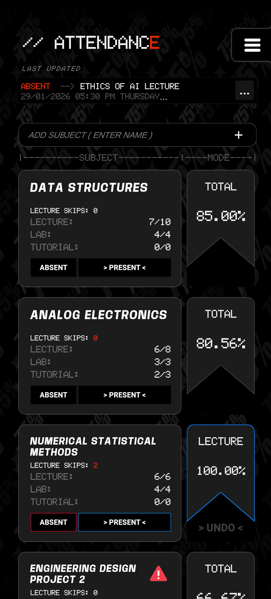
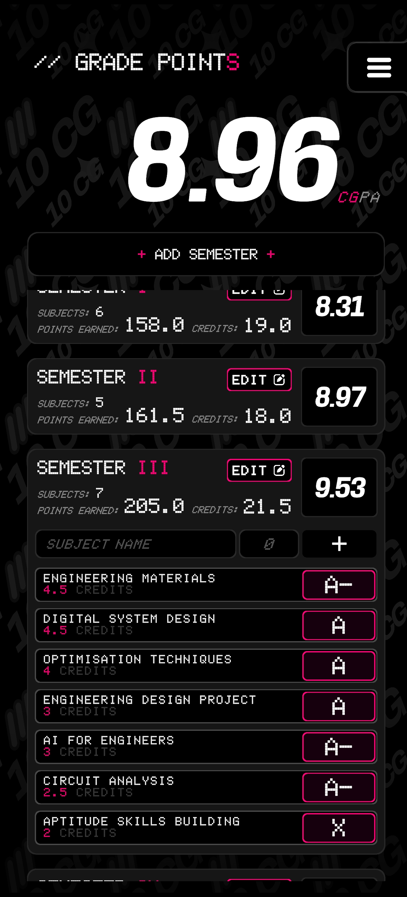

# Attendance Manager & CGPA Calculator

A lightweight, fully offline academic utility built with **Unity**, designed specifically for **TIET students**. The application helps students track attendance across different class types and accurately compute **SGPA** and **CGPA** without relying on an internet connection.

## Features

### Attendance Manager

* Works **completely offline** — no internet required
* Track attendance **individually for each class type** (Lecture, Tutorial, Practical, etc.)
* Automatically calculates **available lecture skips** based on attendance criteria
* Maintains a **detailed action log** to avoid confusion and ensure transparency
* Simple and intuitive UI optimized for daily academic use

### CGPA & SGPA Calculator

* Calculate **SGPA** for individual semesters
* Compute overall **CGPA** using semester-wise credits and SGPA
* Error-safe inputs with clear numerical validation
* Designed to align with **TIET grading structure**

## Tech Stack

* **Engine:** Unity
* **Language:** C#
* **Platform:** Android
* **Storage:** Local persistent storage (no cloud dependency)

## Installation

1. Download the APK from the releases section (or build manually via Unity).
2. Install the APK on your Android device.
3. Launch the app no login or internet access required.

## Privacy

* No internet access required
* No data collection
* All information is stored **locally on the device**

